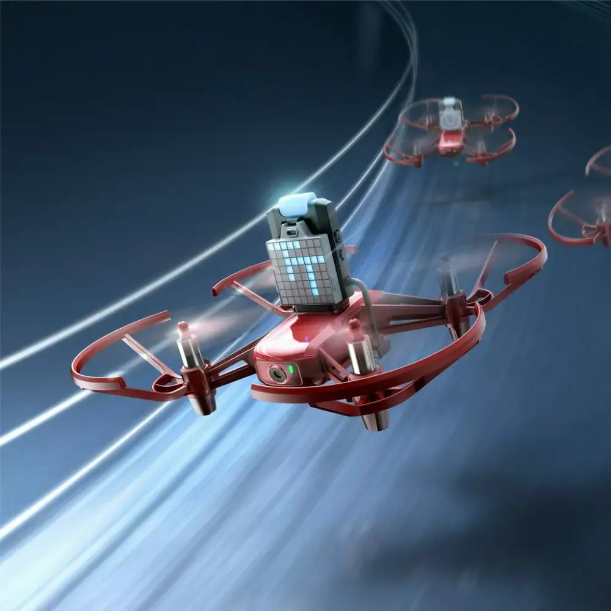

# Muscle-Controlled Drone with OpenBCI and DJI Tello

Control a Robomaster TT (DJI) Tello drone using EMG (electromyography) signals from your muscles via OpenBCI hardware and Lab Streaming Layer (LSL) protocol.

## Overview

This project demonstrates biocontrol interfaces by translating muscle contractions into drone movement commands. The system captures EMG signals from your muscles using OpenBCI hardware, streams the data via LSL, and processes it in real-time to control a Tello drone.


*OpenBCI GUI showing EMG signals and LSL streaming setup*

## Features

- **Real-time EMG Control**: Forward/backward movement based on muscle activity
- **Safety Mechanisms**: Manual keyboard override, emergency landing, battery monitoring
- **Dual Operation Modes**: Hardware mode (real EMG) and simulation mode (synthetic data)
- **LSL Integration**: Robust stream detection with multiple fallback methods
- **Pygame Interface**: User-friendly control window with visual feedback

## Hardware Requirements

- **Robomaster TT (DJI) Tello Drone**
- **OpenBCI Board** (Cyton, Ganglion, or compatible)
- **EMG Electrodes** (surface electrodes for muscle signal acquisition)
- **Computer** with Wi-Fi capability

## Software Requirements

### Python Environment

Create a conda environment and install the required packages:

```bash
# Create new conda environment
conda create -n Tello_drone python=3.9

# Activate environment
conda activate Tello_drone

# Install required packages
pip install djitellopy==2.5.0 pylsl==1.17.6 pygame==2.6.1 numpy==2.0.2 opencv-python==4.10.0.84
```

**Alternative installation methods:**

```bash
# Option 1: Using pip requirements file
pip install -r requirements.txt

# Option 2: Using conda environment file
conda env create -f environment.yml
conda activate Tello_drone
```

### OpenBCI GUI

Download and install the OpenBCI GUI from the [official documentation](https://docs.openbci.com/Software/OpenBCISoftware/GUIDocs/).

## Setup Instructions

### 1. OpenBCI Configuration

1. Launch the OpenBCI GUI
2. Connect your OpenBCI board and configure for EMG recording
3. Add the following widgets:
   - **Networking Widget** (for LSL Protocol)
   - **EMG Joystick Widget** (for muscle-to-joystick conversion)

### 2. LSL Stream Configuration

In the OpenBCI GUI:
1. Open the **Networking** widget
2. Set protocol to **LSL**
3. Configure the **EMG Joystick** widget:
   - Set data type to `EMGJoystick`
   - Configure muscle channels (typically Channel 1 and Channel 2)
   - Adjust sensitivity thresholds as needed
4. Click **Start LSL Stream**

### 3. Electrode Placement

- Place electrodes on your target muscle (forearm flexor/extensor recommended)
- Ensure good skin contact and stable signal quality
- Test muscle contractions in the OpenBCI GUI before proceeding

## Running the Demo

### Step 1: Start OpenBCI Streaming
1. Open OpenBCI GUI
2. Configure widgets as described above
3. Start data streaming
4. Verify EMG signals are visible and LSL stream is active

### Step 2: Test LSL Connection (Optional)
```bash
python lsl_stream_finder.py
```
This script will detect and list all available LSL streams. You should see your EMGJoystick stream listed.

### Step 3: Connect to Tello
1. Turn on you Tello drone
2. Connect your computer to the Tello's Wi-Fi network (TELLO-XXXXXX)

### Step 4: Run the Control Program
```bash
python tello_emg_control.py
```

## Control Scheme

### Manual Controls (Keyboard)
- `t` - Takeoff
- `l` - Land
- `r` - Rotate clockwise (hold)
- `Shift+r` - Rotate counter-clockwise (hold)
- `q` - Quit program

### EMG Controls (Automatic when flying)
- **Muscle Flex (negative signal)** → Drone moves backward
- **Muscle Extension/Relaxation** → Drone moves forward
- **Minimal Activity** → Drone hovers in place

## Files Description

- `tello_emg_control.py` - Main control program with EMG processing and drone control
- `lsl_stream_finder.py` - Utility script to detect and troubleshoot LSL streams
- `README.md` - This documentation file

## Troubleshooting

### No LSL Streams Found
- Ensure OpenBCI GUI is running and streaming
- Check that LSL widget is properly configured
- Verify both applications are on the same machine
- Check firewall settings for UDP communication

### Drone Connection Issues
- Verify Tello is powered on and in range
- Check Wi-Fi connection to Tello network
- Ensure battery level is sufficient (>20%)

### EMG Signal Issues
- Check electrode placement and skin contact
- Adjust sensitivity thresholds in EMG Joystick widget
- Verify muscle contractions produce visible signals in GUI

## Safety Notes

- Always maintain manual control capability
- Test in open indoor space away from obstacles
- Monitor battery levels regularly
- Keep drone within visual range
- EMG control only activates when drone is airborne

## Technical Details

### Signal Processing Pipeline
1. **Acquisition**: OpenBCI captures raw EMG signals
2. **Filtering**: GUI applies noise reduction and signal conditioning
3. **Streaming**: LSL protocol transmits processed data
4. **Processing**: Python script applies smoothing and threshold detection
5. **Control**: Muscle contractions translated to drone movement commands

### LSL Stream Format
- Stream Type: `EMGJoystick`
- Data Format: 2-channel float values [x, y]
- Sample Rate: Configured in OpenBCI GUI
- Data Range: Typically -1.0 to +1.0

## Future Extensions

- Multi-channel EMG for complex flight patterns
- Gesture recognition for advanced commands
- Integration with other biometric sensors
- Brain-computer interface (BCI) implementation using EEG

## Dependencies

Check installed packages in your conda environment:

```bash
# Activate the environment
conda activate Tello_drone

# List all packages
conda list

# List specific packages
conda list djitellopy pylsl pygame numpy

# Export environment for sharing
conda env export > environment.yml
```

### Environment Files Included

This repository includes:
- `requirements.txt` - Essential packages for pip installation
- `environment.yml` - Complete conda environment specification

The `Tello_drone` environment uses Python 3.9.21 and includes all necessary dependencies for drone control and EMG signal processing.

## Contributing

Feel free to submit issues, feature requests, or pull requests to improve this project.

## License

This project is provided as-is for educational and research purposes.

## Acknowledgments

- OpenBCI community for open-source BCI tools
- Robomaster TT (DJI) Tello SDK and djitellopy library maintainers
- Lab Streaming Layer (LSL) development team
